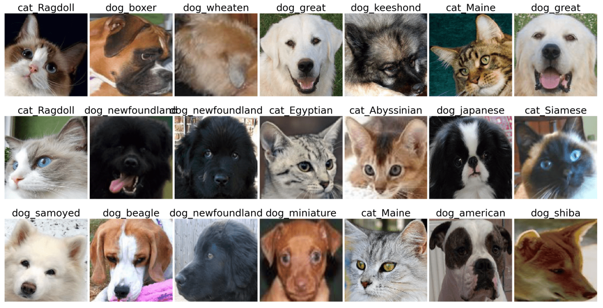

[](https://classroom.github.com/online_ide?assignment_repo_id=7801077&assignment_repo_type=AssignmentRepo)
# Лабораторная работа по курсу "Искусственный интеллект"
# Классификация изображений.

| Студент | Моисеенков Илья Павлович |
|------|------|
| Группа  | 308 |
| Оценка 1 (обучение "с нуля") | *X* |
| Оценка 2 (transfer learning) | *X* |
| Проверил | Сошников Д.В. |

> *Комментарии проверяющего*
### Задание

Решить задачу классификации пород кошек и собак на основе датасета [Oxford-IIIT](https://www.robots.ox.ac.uk/~vgg/data/pets/).



#### Задание 1: Классификация Pet Faces

Обучить свёрточную нейронную сеть для классификации пород кошек и собак на основе упрощённого датасета **Pet Faces**. Самостоятельно придумать архитектуру сети, реализовать предобработку входных данных.

Для загрузки датасета используйте следующий код:

```python
!wget https://mslearntensorflowlp.blob.core.windows.net/data/petfaces.tar.gz
!tar xfz petfaces.tar.gz
!rm petfaces.tar.gz
```

В качестве результата необходимо:

* Посчитать точность классификатора на тестовом датасете
* Посчитать точность двоичной классификации "кошки против собак" на текстовом датасете
* Построить confusion matrix
* **[На хорошую и отличную оценку]** Посчитайте top-3 accuracy
* **[На отличную оценку]** Выполнить оптимизацию гиперпараметров: архитектуры сети, learning rate, количества нейронов и размеров фильтров.

Решение оформите в файле [Faces.ipynb](Faces.ipynb).

Использовать нейросетевой фреймворк в соответствии с вариантом задания:
   * Чётные варианты - PyTorch
   * Нечётные варианты - Tensorflow/Keras
#### Задание 2: Классификация полных изображений с помощью transfer learning

Используйте оригинальный датасет **Oxford Pets** и предобученные сети VGG-16/VGG-19 и ResNet для построение классификатора пород. Для загрузки датасета используйте код:

```python
!wget https://mslearntensorflowlp.blob.core.windows.net/data/oxpets_images.tar.gz
!tar xfz oxpets_images.tar.gz
!rm oxpets_images.tar.gz
```

В качестве результата необходимо:

* Посчитать точность классификатора на тестовом датасете отдельно для VGG-16/19 и ResNet, для дальнейших действий выбрать сеть с лучшей точностью
* Посчитать точность двоичной классификации "кошки против собак" на текстовом датасете
* Построить confusion matrix
* **[На отличную оценку]** Посчитайте top-3 и top-5 accuracy

Решение оформите в файле [Pets.ipynb](Pets.ipynb).

Использовать нейросетевой фреймворк, отличный от использованного в предыдущем задании, в соответствии с вариантом задания:
   * Нечётные варианты - PyTorch
   * Чётные варианты - Tensorflow/Keras

## Codespaces

По возможности, используйте GitHub Codespaces для выполнения работы. По результатам, дайте обратную связь:
1. Что понравилось?
1. Что не понравилось?
1. Какие ошибки или существенные затруднения в работе вы встречали? (По возможности, будьте как можно более подробны, указывайте шаги для воспроизведения ошибок)

---

# Отчет
## Часть 1

В первой части мне нужно было придумать архитектуру сверточной нейронной сети для классификации изображений. Работал я на тензорфлоу.

Моя сверточная сеть выглядит так:  
[Свертка + Макс пулинг + Релу] x3 + Дропаут + Линейный слой + Софтмакс

Перед обучением выполняется аугментация изображений (отражение относительно оси у, поворот или зум с вероятностью 0.1) и нормировка (приведение всех чисел к интервалу [0; 1].

Лосс - кросс энтропия  
Оптимизатор - адам  
Лернинг рейт - 1е-3  
Эпохи - 50

Я пробовал изменять количество сверточных и линейных слоев, добавлять регуляризацию (дропаут с разными вероятностями, аугментацию данных), менять лернинг рейт и параметры сверток (размер ядра, количество выходных каналов). Полученная сеть оказалась наиболее точной.

Метрики:  
эккюраси = 0.67  
топ 3 эккюраси = 0.88  
точность бинарной классификации кошки vs собаки = 0.96  
Матрица неточностей:  
  
Графики лоссов и точностей в зависимости от эпох:  
  

Модель хорошо научилась различать кошек и собак: видим точность бинарной классификации 0.96, а также видим, что левая нижняя и правая верхняя части матрицы неточностей почти нулевые (где пересекаются кошки и собаки).

Определять непосредственно породы кошек и собак модель может не всегда. Имеем точность 0.67. Однако в 88% случаев правильная порода находится в топ 3 предсказаниях модели.

Сейчас у нас немного фотографий в датасете для каждого класса, поэтому стоит либо расширить датасет, либо попробовать пофайнтюнить нейросетку для получения лучшего результата

## Часть 2

Во 2 части мне нужно было использовать предобученные модели для классификации собак и кошек по породам. Здесь я работал на торче.

Я попробовал две сети: VGG-16 и ResNet-18. Обе сети были предобучены на ImageNet. В каждой сети я заменил последний полносвязный слой, чтобы на выходе у меня было не 1000 классов, а столько, сколько в моем датасете.

Так как модели предобучены, то они уже неплохо справляются с выделением фичей из картинок. Это значит, что не нужно много эпох на дообучение. Я решил сделать 2 эпохи обучения (я пробовал и больше - 10, но результат был примерно одинаковый, а времени уходило больше). Обе сети показали себя примерно одинаково - получили эккюраси 0.81-0.82.

Для реснета я посчитал дополнительные метрики:  
топ 3 эккюраси = 0.95  
топ 5 эккюраси = 0.98

Матрица неточностей:  


Графики лосса и эккюраси от эпох:  
  


По поводу бинарной точности кошек vs собак:  
К сожалению, из датасета нельзя быстро понять, какая из пород относится к собакам, а какая к кошкам. А на ручную разметку времени, к сожалению нет :(  
Но мы можем прикинуть точность по построенной конфьюжен матрице. Я посмотрел на ячейки с большими числами, которые не лежат на диагонали. Там я увидел несколько случаев, когда модель просто путает породы собак (или породы кошек). Но иногда она путает собак и кошек в принципе (например, 12 раз она перепутала бульдога с мейн куном). Но в целом таких случаев не так много - не больше 50. Значит, точность классификации кошек и собак примерно равна 96% (или даже выше)

## Вывод

В этой работе я попрактиковался в обучении сверточных нейросетей для классификации изображений. Я попробовал два подхода: обучение сети с нуля и трансфер лернинг. Второй подход, конечно же, оказался более точным из-за инициализации модели весами, полученных после обучения на ImageNet.

Также я познакомился с фреймворком Тензорфлоу, на котором мне до этого не приходилось работать. Оказалось, что это очень удобный инструмент, где большая часть работы уже сделана за нас. Но этот фреймворк не очень гибкий по сравнению с торчом. Поэтому я бы использовал тензорфлоу для решения простых задач.

---

## Материалы для изучения

* [Deep Learning for Image Classification Workshop](https://github.com/microsoft/workshop-library/blob/main/full/deep-learning-computer-vision/README.md)
* [Convolutional Networks](https://github.com/microsoft/AI-For-Beginners/blob/main/4-ComputerVision/07-ConvNets/README.md)
* [Transfer Learning](https://github.com/microsoft/AI-For-Beginners/blob/main/4-ComputerVision/08-TransferLearning/README.md)
